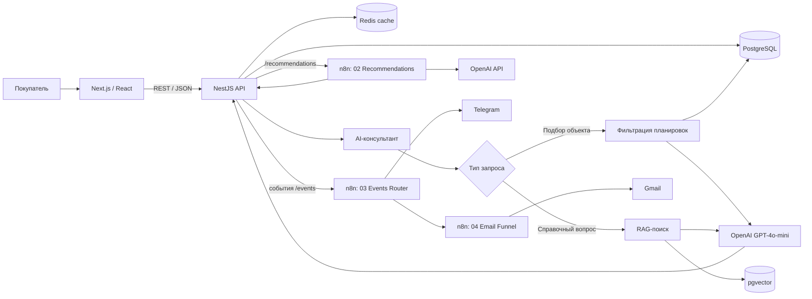
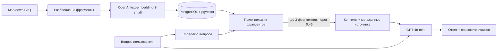
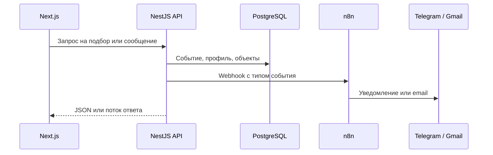
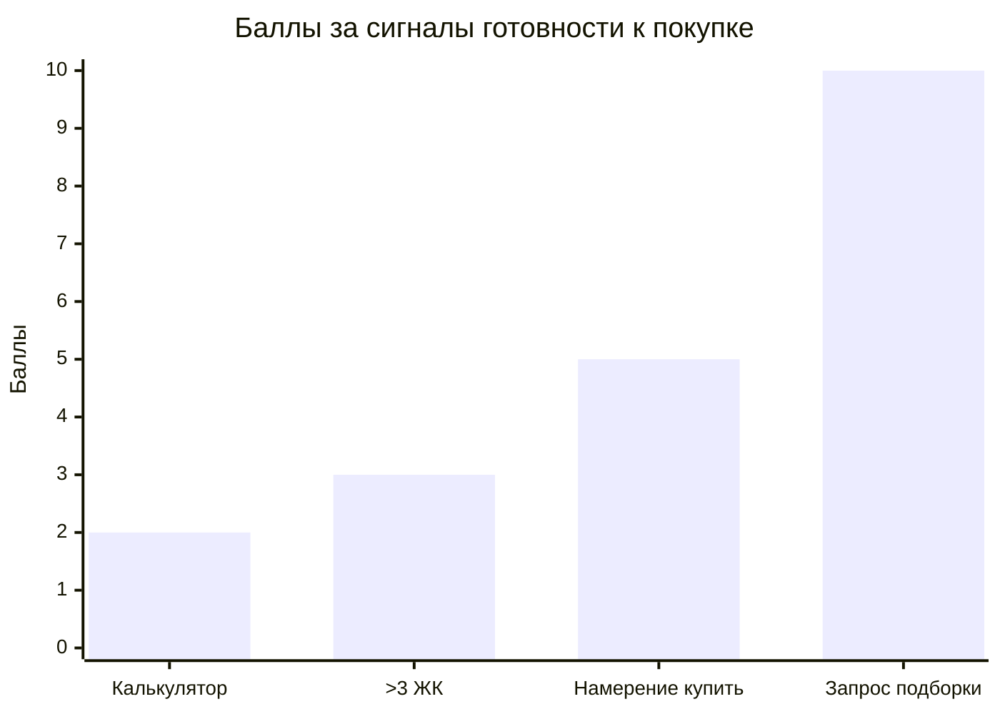

# AI Real Estate Consultant — Новостройки Уфы

Пет-проект AI-консультанта, который помогает подобрать новостройку по бюджету и параметрам квартиры, отвечает на справочные вопросы по базе знаний и передаёт события пользователя в автоматизации.

> **Статус:** учебный прототип для портфолио. Каталог и FAQ содержат демонстрационные данные.
>
> **Демо:** [estate-ufa.vercel.app](https://estate-ufa.vercel.app) · API: [estate-ufa-api.vercel.app](https://estate-ufa-api.vercel.app/properties)

## Публикация: Vercel + Neon

Онлайн-версия состоит из трёх частей:

| Часть | Где | Root Directory |
|---|---|---|
| PostgreSQL + pgvector | Neon | — |
| NestJS API | Vercel (Framework Preset: NestJS) | `apps/api` |
| Next.js сайт | Vercel (Framework Preset: Next.js) | `apps/web` |

Redis и n8n в онлайн-версии не развёрнуты: API работает без кэша и автоматизаций. Полный набор сервисов поднимается локально через Docker Compose (см. ниже).

Схема БД загружается командой `npm run db:push` из `apps/api` (с `DATABASE_URL` от Neon), демо-данные загружает `npm run db:seed`.

### Переменные окружения

**API** (`apps/api`):

| Переменная | Обязательна | Значение |
|---|---|---|
| `DATABASE_URL` | да | Pooled-строка подключения Neon (хост с `-pooler`) |
| `JWT_SECRET` | да | Длинная случайная строка; без неё API на Vercel не запустится |
| `FRONTEND_URL` | да | URL сайта; несколько значений — через запятую |
| `OPENAI_API_KEY` | да | Для AI-чата, RAG и рекомендаций |
| `NODE_ENV` | — | `production` |
| `REDIS_URL`, `N8N_WEBHOOK_URL` | нет | Без них API работает без кэша и автоматизаций |
| `SWAGGER_ENABLED` | нет | `true` — открыть `/api/docs` на проде |

**Сайт** (`apps/web`). Значения `NEXT_PUBLIC_*` попадают в клиентский bundle, секреты туда добавлять нельзя.

| Переменная | Значение |
|---|---|
| `NEXT_PUBLIC_API_URL` | Публичный HTTPS URL API |
| `NEXT_PUBLIC_SITE_URL` | URL сайта, например `https://estate-ufa.vercel.app` |
| `NEXT_PUBLIC_YANDEX_MAPS_KEY` | Ключ JavaScript API Яндекс Карт с ограничением по домену сайта |

### Роли и доступ к лидам

У пользователя есть поле `role`: `user` (по умолчанию), `manager` или `admin`. Список лидов и панель `/admin/leads` доступны `manager` и `admin`, запуск парсера — только `admin`. Роль назначается в базе:

```sql
UPDATE users SET role = 'admin' WHERE email = 'you@example.com';
```

### Ограничения запросов

Лимиты по IP: 60 запросов в минуту на любой маршрут, дополнительно 30/мин на чат и 10/мин на регистрацию и вход. В чат принимается не больше 50 сообщений, в модель уходят последние 10, длина ответа ограничена 700 токенами.

## Задача и решение

Покупатель описывает запрос обычным языком, например: «Ищу двушку до 7 млн рядом с центром». Сервис извлекает параметры, ищет подходящие планировки в PostgreSQL и формирует ответ. Для вопросов о каталоге и правилах консультант использует RAG и показывает источники.

В проекте разделены задачи, где нужен точный контроль, и задачи, где полезна генерация:

- **PostgreSQL и Prisma** фильтруют ЖК и планировки по данным каталога.
- **Скоринг лида** вычисляется заданными правилами, а не оценкой LLM.
- **LLM** классифицирует запрос и формулирует ответ по найденным данным.
- **RAG** ищет подтверждённый контекст и позволяет отказаться от ответа, если источников недостаточно.
- **n8n** маршрутизирует события и запускает уведомления.

## Возможности

- Каталог ЖК, страницы объектов, планировки, избранное и карта.
- Регистрация и вход, профиль предпочтений пользователя.
- AI-чат с потоковой выдачей ответа.
- Подбор планировок по комнатам и бюджету с последующим объяснением вариантов.
- Ответы на FAQ с указанием источников.
- Создание лида и детерминированная оценка готовности клиента.
- Автоматизации n8n для рекомендаций, событий, Telegram-уведомлений и email-цепочки.
- Swagger-документация REST API (локально; на проде включается `SWAGGER_ENABLED=true`).

## Архитектура

### Основные сервисы



### RAG: от документа к ответу с источником



**Индексация:** при старте API читает Markdown-файлы из `apps/api/knowledge-base/`, разбивает текст на фрагменты целевого размера около 1200 символов, создаёт embeddings размерностью 1536 и записывает их в таблицу `rag_chunks`. Хэш документа позволяет пропускать неизменённые источники.

**Ответ:** поиск возвращает до трёх фрагментов при similarity не ниже 0.45. Если подтверждённый контекст не найден, консультант сообщает об этом вместо ответа из памяти модели.

### События и workflow

| Workflow | Вход | Назначение |
|---|---|---|
| **01 — New Lead → Telegram** | `POST /webhook/new-lead` | Формирует уведомление о лиде. При score ≥ 10 отправляет отдельное уведомление о горячем лиде. |
| **02 — Recommendations → GPT** | `POST /webhook/recommendations` | Получает кандидатов из API, просит OpenAI ранжировать их и вернуть краткое обоснование в JSON. |
| **03 — Events Router** | `POST /webhook/events` | Разбирает пользовательские события. Для горячих фраз в чате может отправить Telegram-уведомление. |
| **04 — Email Funnel** | `POST /webhook/lead-funnel` | Отправляет письмо сразу, затем продолжает цепочку после ожиданий в 2 и 5 дней. |



## Lead scoring

Оценка строится по фиксированным правилам. LLM не назначает баллы.



| Сигнал | Баллы |
|---|---:|
| Использовал калькулятор | +2 |
| Посмотрел больше 3 ЖК | +3 |
| В сообщении есть фраза о намерении купить | +5 |
| Запросил подборку | +10 |

**Горячий лид:** score ≥ 10. Итог сохраняется в таблице лидов вместе со snapshot профиля и пользовательских сигналов.

Правило `CALCULATOR_USED` входит в алгоритм скоринга; передачу этого события из интерфейса калькулятора следует проверить при расширении пользовательского сценария.

## Проверка интеграций

Проведены ручные smoke-проверки опубликованных webhook workflow на тестовых данных:

- **01:** score 10 прошёл фильтр, выполнились обычное и горячее Telegram-уведомления.
- **02:** OpenAI вернул рекомендацию в ожидаемой JSON-структуре.
- **03:** горячая фраза прошла через intent-фильтр и Telegram-узел.
- **04:** Gmail-узел принял первое письмо; workflow продолжил работу и ожидает следующий шаг цепочки.

Это проверки отдельных workflow через webhook; они не являются автоматическими end-to-end тестами полного пути лида с сайта.

## Технологический стек

| Область | Технологии |
|---|---|
| Frontend | Next.js 15.5.27, React 18, TypeScript, Zustand |
| Backend | NestJS 10, TypeScript, REST API, JSON, Swagger / OpenAPI |
| Основная БД | PostgreSQL 16, Prisma ORM 5 |
| Векторный поиск | pgvector, SQL-оператор cosine distance |
| Кэш | Redis 7 |
| LLM | OpenAI Chat Completions, GPT-4o-mini, streaming, JSON object output |
| Embeddings | OpenAI `text-embedding-3-small` |
| Автоматизация | n8n, webhooks, HTTP Request, Code (JavaScript), Switch, Filter, Wait |
| Внешние интеграции | Telegram Bot API, Gmail OAuth2 |
| Авторизация и валидация | JWT, Passport, bcrypt, class-validator |
| Инфраструктура | Docker, Docker Compose, отдельные PostgreSQL-базы `estate_db` и `n8n_db` |

## REST API: основные маршруты

| Метод | Маршрут | Назначение |
|---|---|---|
| `POST` | `/auth/register`, `/auth/login` | Регистрация и получение JWT |
| `GET` | `/properties`, `/properties/:slug` | Каталог и карточка ЖК |
| `POST` | `/chat/message` | Сообщение AI-консультанту; ответ передаётся потоком |
| `GET` | `/recommendations` | Подборка ЖК; для авторизованного пользователя используется n8n/GPT |
| `POST` | `/events/track` | Запись события пользователя и передача его в n8n |
| `POST` | `/leads` | Создание лида и расчёт score |
| `GET` | `/api/docs` | Swagger UI (только локально или при `SWAGGER_ENABLED=true`) |

## Запуск локально

### Требования

- Docker Desktop с Docker Compose.
- OpenAI API key для чата, embeddings и GPT-рекомендаций.
- Telegram bot/chat для уведомлений — опционально.
- Gmail OAuth2 credentials — если проверяете email workflow.

### Установка

```bash
git clone https://github.com/Zaynetdinova/estate_ufa.git
cd estate_ufa/infra
cp .env.example .env
```

Заполните `infra/.env`: как минимум задайте надёжные значения для `POSTGRES_PASSWORD`, `JWT_SECRET`, `N8N_PASSWORD`, `N8N_ENCRYPTION_KEY` и добавьте `OPENAI_API_KEY`. Для Telegram укажите `TELEGRAM_CHAT_ID`. Не коммитьте файл `.env`.

Создайте схему приложения и демонстрационные данные:

```bash
docker compose up -d postgres redis
docker compose build api web
docker compose run --rm --no-deps api npx prisma db push
docker compose run --rm --no-deps api npm run db:seed
docker compose up -d --build
```

Откройте:

- Сайт: [http://localhost:3000](http://localhost:3000)
- API: [http://localhost:4000](http://localhost:4000)
- Swagger: [http://localhost:4000/api/docs](http://localhost:4000/api/docs)
- n8n: [http://localhost:5678](http://localhost:5678)
- Prisma Studio: [http://localhost:5555](http://localhost:5555)

### Настройка n8n

При пустом экземпляре импортируйте нужные workflow из `infra/n8n-workflows/` через интерфейс n8n. Настройте Telegram Bot credential и Gmail OAuth2 credential в n8n. Значение Telegram Chat ID передаётся в контейнер через `TELEGRAM_CHAT_ID`; личные credentials хранятся в n8n и в Git не включаются.

## Ручная оценка RAG

Набор контрольных вопросов: [rag-evaluation-cases.json](apps/api/knowledge-base/rag-evaluation-cases.json). Он включает случаи, где консультант должен ответить по FAQ, и вопросы, где нужно воздержаться от неподтверждённого ответа.

Это **ручная проверка**, не автоматический benchmark. Для каждого кейса сравните ответ и заголовок источника с ожидаемыми полями.

## Структура репозитория

```text
apps/
  web/                     Next.js интерфейс
  api/
    src/
      chat/                AI-чат и маршрутизация запросов
      knowledge/           Индексация и retrieval для RAG
      leads/               Создание лидов и детерминированный scoring
      properties/          Каталог и фильтрация планировок
      recommendations/     Подборки
      events/              События пользователя
      n8n/                 Webhook-клиент и event-типы
    knowledge-base/        FAQ и набор ручной оценки RAG
    prisma/                Prisma schema и seed
infra/
  docker-compose.yml       Локальная инфраструктура
  n8n-workflows/           Экспортируемые workflow JSON
  postgres-init/           Создание отдельной БД n8n
ARCHITECTURE.md             Расширенная техническая архитектура
```

## Границы прототипа и следующие шаги

- Данные ЖК и FAQ демонстрационные; их нельзя считать актуальными коммерческими предложениями.
- Онлайн-версия работает без Redis и n8n; уведомления и email-цепочка доступны только в локальном Docker Compose.
- Backend отправляет события лидов на общий webhook `/events`, а workflow 01 слушает отдельный `/new-lead`. Для автоматического уведомления нового лида нужно добавить маршрутизацию события `NEW_LEAD` или направить событие на соответствующий webhook.
- Email workflow ожидает `eventType: NEW_LEAD` и `payload.userEmail`. Для запуска из приложения нужно передавать эти данные в workflow 04; запрос на подборку сам по себе email не содержит.
- Геопожелание «рядом с центром» пока не проверяется по расстоянию: фильтр поддерживает конкретный район, бюджет и число комнат.
- Источники RAG — Markdown-файлы; загрузка PDF, права доступа по документам, автоматические оценки качества и reranking не реализованы.
- Проект не использует LangChain, LangGraph, Dify, Flowise или MCP. RAG реализован напрямую через OpenAI API, PostgreSQL и pgvector.

Перспективные улучшения: связать события лида и email-цепочку без потери payload, добавить автоматические RAG-evals, развернуть n8n и Redis для онлайн-версии и ввести контроль актуальности каталога.

## Для портфолио

Проект демонстрирует путь от бизнес-сценария до работающего AI-сервиса: извлечение структуры из естественного языка, безопасный поиск по каталогу, RAG с источниками и отказом от неподтверждённого ответа, правила lead scoring, REST/webhook-интеграции и управление процессами в n8n.
